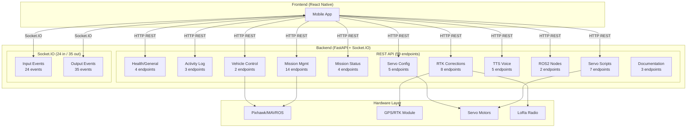

# Backend Server Communication Analysis

## Summary Counts

| Category | Count |
|---|---|
| **HTTP/REST Endpoints** | **44** |
| **Socket.IO Input Events** (frontend → backend) | **18** |
| **Socket.IO Output Events** (backend → frontend) | **25** |
| **Total Communication Interfaces** | **87** |

---

## 1. HTTP/REST Endpoints (44 total)

### General / Health (4)

| # | Method | Path | Line | Description |
|---|--------|------|------|-------------|
| 1 | `GET` | [`/`](Backend/NRP_ROS/Backend/server.py:3687) | 3687 | Root endpoint — server status |
| 2 | `GET` | [`/monitor`](Backend/NRP_ROS/Backend/server.py:3701) | 3701 | Activity monitor dashboard (HTML) |
| 3 | `GET` | [`/node/{node_name}`](Backend/NRP_ROS/Backend/server.py:3712) | 3712 | Node details page (HTML) |
| 4 | `GET` | [`/api/health`](Backend/NRP_ROS/Backend/server.py:151) | 151 | Health check (referenced in middleware, likely auto-generated or implicit) |

### Activity Log (3)

| # | Method | Path | Line | Description |
|---|--------|------|------|-------------|
| 5 | `GET` | [`/api/activity`](Backend/NRP_ROS/Backend/server.py:3736) | 3736 | Recent backend activity entries with filtering |
| 6 | `GET` | [`/api/activity/types`](Backend/NRP_ROS/Backend/server.py:3762) | 3762 | Known activity event types |
| 7 | `GET` | [`/api/activity/download`](Backend/NRP_ROS/Backend/server.py:3770) | 3770 | Download activity log as text file |

### Vehicle Control (2)

| # | Method | Path | Line | Description |
|---|--------|------|------|-------------|
| 8 | `POST` | [`/api/arm`](Backend/NRP_ROS/Backend/server.py:3801) | 3801 | Arm/disarm vehicle |
| 9 | `POST` | [`/api/set_mode`](Backend/NRP_ROS/Backend/server.py:3817) | 3817 | Set vehicle flight mode |

### Mission Management (14)

| # | Method | Path | Line | Description |
|---|--------|------|------|-------------|
| 10 | `POST` | [`/api/mission/upload`](Backend/NRP_ROS/Backend/server.py:3835) | 3835 | Upload mission waypoints to vehicle |
| 11 | `GET` | [`/api/mission/download`](Backend/NRP_ROS/Backend/server.py:3858) | 3858 | Download mission from vehicle |
| 12 | `POST` | [`/api/mission/clear`](Backend/NRP_ROS/Backend/server.py:3870) | 3870 | Clear all mission waypoints |
| 13 | `POST` | [`/api/mission/set_current`](Backend/NRP_ROS/Backend/server.py:3881) | 3881 | Skip to specific waypoint |
| 14 | `POST` | [`/api/mission/resume_deprecated`](Backend/NRP_ROS/Backend/server.py:3919) | 3919 | Resume mission (deprecated) |
| 15 | `GET` | [`/api/mission/config`](Backend/NRP_ROS/Backend/server.py:3939) | 3939 | Get mission controller config |
| 16 | `POST` | [`/api/mission/config`](Backend/NRP_ROS/Backend/server.py:3958) | 3958 | Update servo/timer config |
| 17 | `POST` | [`/api/mission/load`](Backend/NRP_ROS/Backend/server.py:4071) | 4071 | Load waypoints to mission controller |
| 18 | `POST` | [`/api/mission/start`](Backend/NRP_ROS/Backend/server.py:4174) | 4174 | Start mission execution |
| 19 | `GET` | [`/api/mission/start`](Backend/NRP_ROS/Backend/server.py:4187) | 4187 | Inform clients POST is required |
| 20 | `POST` | [`/api/mission/stop`](Backend/NRP_ROS/Backend/server.py:4193) | 4193 | Stop mission execution |
| 21 | `POST` | [`/api/mission/pause`](Backend/NRP_ROS/Backend/server.py:4278) | 4278 | Pause mission |
| 22 | `POST` | [`/api/mission/resume`](Backend/NRP_ROS/Backend/server.py:4298) | 4298 | Resume mission |
| 23 | `POST` | [`/api/mission/restart`](Backend/NRP_ROS/Backend/server.py:4318) | 4318 | Restart mission from beginning |
| 24 | `POST` | [`/api/mission/next`](Backend/NRP_ROS/Backend/server.py:4342) | 4342 | Advance to next waypoint |
| 25 | `POST` | [`/api/mission/skip`](Backend/NRP_ROS/Backend/server.py:4356) | 4356 | Skip current waypoint |

### Mission Status & Mode (4)

| # | Method | Path | Line | Description |
|---|--------|------|------|-------------|
| 26 | `GET` | [`/api/mission/status`](Backend/NRP_ROS/Backend/server.py:4370) | 4370 | Get mission controller status |
| 27 | `GET` | [`/api/mission/mode`](Backend/NRP_ROS/Backend/server.py:4396) | 4396 | Get mission mode (auto/manual) |
| 28 | `POST` | [`/api/mission/mode`](Backend/NRP_ROS/Backend/server.py:4421) | 4421 | Set mission mode |
| 29 | `POST` | [`/api/mission/stop_controller`](Backend/NRP_ROS/Backend/server.py:4464) | 4464 | Stop mission controller node |

### Servo Configuration (5)

| # | Method | Path | Line | Description |
|---|--------|------|------|-------------|
| 30 | `POST` | [`/api/mission/servo_config`](Backend/NRP_ROS/Backend/server.py:4206) | 4206 | Update servo config dynamically |
| 31 | `GET` | [`/api/mission/servo_config`](Backend/NRP_ROS/Backend/server.py:4251) | 4251 | Get current servo config |
| 32 | `GET` | [`/api/config/sprayer`](Backend/NRP_ROS/Backend/server.py:4499) | 4499 | Get sprayer config |
| 33 | `POST` | [`/api/config/sprayer`](Backend/NRP_ROS/Backend/server.py:4523) | 4523 | Save sprayer config |
| 34 | `POST` | [`/api/servo/control`](Backend/NRP_ROS/Backend/server.py:5032) | 5032 | Direct servo PWM control |

### RTK Corrections (7)

| # | Method | Path | Line | Description |
|---|--------|------|------|-------------|
| 35 | `POST` | [`/api/rtk/inject`](Backend/NRP_ROS/Backend/server.py:4628) | 4628 | Start NTRIP RTK injection |
| 36 | `POST` | [`/api/rtk/stop`](Backend/NRP_ROS/Backend/server.py:4697) | 4697 | Stop all RTK streams |
| 37 | `POST` | [`/api/rtk/ntrip_stop`](Backend/NRP_ROS/Backend/server.py:4736) | 4736 | Stop NTRIP stream only |
| 38 | `POST` | [`/api/rtk/lora_stop`](Backend/NRP_ROS/Backend/server.py:4757) | 4757 | Stop LoRa stream only |
| 39 | `POST` | [`/api/rtk/ntrip_start`](Backend/NRP_ROS/Backend/server.py:4787) | 4787 | Start NTRIP stream |
| 40 | `POST` | [`/api/rtk/lora_start`](Backend/NRP_ROS/Backend/server.py:4885) | 4885 | Start LoRa RTK stream |
| 41 | `GET` | [`/api/rtk/status`](Backend/NRP_ROS/Backend/server.py:4956) | 4956 | Get RTK stream status |
| 42 | `POST` | [`/api/rtk/force_clear`](Backend/NRP_ROS/Backend/server.py:4986) | 4986 | Force-clear GPS RTK fix |

### TTS Voice Control (5)

| # | Method | Path | Line | Description |
|---|--------|------|------|-------------|
| 43 | `GET` | [`/api/tts/status`](Backend/NRP_ROS/Backend/server.py:5096) | 5096 | Get TTS status |
| 44 | `POST` | [`/api/tts/control`](Backend/NRP_ROS/Backend/server.py:5137) | 5137 | Enable/disable TTS |
| 45 | `POST` | [`/api/tts/test`](Backend/NRP_ROS/Backend/server.py:5201) | 5201 | Test TTS with custom message |
| 46 | `GET` | [`/api/tts/languages`](Backend/NRP_ROS/Backend/server.py:5255) | 5255 | Get supported TTS languages |
| 47 | `POST` | [`/api/tts/language`](Backend/NRP_ROS/Backend/server.py:5273) | 5273 | Set TTS language |

### ROS 2 Node Management (2)

| # | Method | Path | Line | Description |
|---|--------|------|------|-------------|
| 48 | `GET` | [`/api/nodes`](Backend/NRP_ROS/Backend/server.py:5324) | 5324 | List active ROS 2 nodes |
| 49 | `GET` | [`/api/node/{node_name}`](Backend/NRP_ROS/Backend/server.py:5342) | 5342 | Detailed ROS 2 node info |

### Servo Manager Scripts (6)

| # | Method | Path | Line | Description |
|---|--------|------|------|-------------|
| 50 | `GET` | [`/servo/run`](Backend/NRP_ROS/Backend/server.py:5501) | 5501 | Run servo script (continuous/interval/wpmark) |
| 51 | `GET` | [`/servo/stop`](Backend/NRP_ROS/Backend/server.py:5550) | 5550 | Stop servo script |
| 52 | `POST` | [`/servo/emergency_stop`](Backend/NRP_ROS/Backend/server.py:5562) | 5562 | Emergency stop all servo scripts |
| 53 | `GET` | [`/servo/status`](Backend/NRP_ROS/Backend/server.py:5588) | 5588 | Servo status + telemetry |
| 54 | `GET` | [`/servo/edit`](Backend/NRP_ROS/Backend/server.py:5620) | 5620 | Edit servo config (query params) |
| 55 | `POST` | [`/servo/edit`](Backend/NRP_ROS/Backend/server.py:5643) | 5643 | Edit servo config (JSON body) |
| 56 | `GET` | [`/servo/log`](Backend/NRP_ROS/Backend/server.py:5682) | 5682 | Read servo script log |

### Documentation Routes (from [`socket_docs_router.py`](Backend/NRP_ROS/Backend/socket_docs_router.py)) (3)

| # | Method | Path | Line | Description |
|---|--------|------|------|-------------|
| 57 | `GET` | [`/asyncapi`](Backend/NRP_ROS/Backend/socket_docs_router.py:14) | 14 | AsyncAPI UI page |
| 58 | `GET` | [`/api/docs/asyncapi.yaml`](Backend/NRP_ROS/Backend/socket_docs_router.py:18) | 18 | AsyncAPI YAML spec |
| 59 | `GET` | [`/socket-docs`](Backend/NRP_ROS/Backend/socket_docs_router.py:28) | 28 | Socket.IO interactive docs |

---

## 2. Socket.IO Input Events — Frontend → Backend (18 total)

| # | Event Name | Line | Description |
|---|------------|------|-------------|
| 1 | [`connect`](Backend/NRP_ROS/Backend/server.py:3091) | 3091 | Client connection handler |
| 2 | [`disconnect`](Backend/NRP_ROS/Backend/server.py:3148) | 3148 | Client disconnection handler |
| 3 | [`ping`](Backend/NRP_ROS/Backend/server.py:3165) | 3165 | Connection health ping |
| 4 | [`send_command`](Backend/NRP_ROS/Backend/server.py:3288) | 3288 | Dispatch vehicle commands (ARM_DISARM, SET_MODE, GOTO, UPLOAD_MISSION, GET_MISSION, CLEAR_MISSION) |
| 5 | [`mission_upload`](Backend/NRP_ROS/Backend/server.py:2543) | 2543 | Upload mission waypoints (DEPRECATED — use REST) |
| 6 | [`request_mission_logs`](Backend/NRP_ROS/Backend/server.py:2524) | 2524 | Request mission log history |
| 7 | [`subscribe_mission_status`](Backend/NRP_ROS/Backend/server.py:3228) | 3228 | Subscribe to mission status updates |
| 8 | [`get_mission_status`](Backend/NRP_ROS/Backend/server.py:3262) | 3262 | Request current mission status |
| 9 | [`connect_caster`](Backend/NRP_ROS/Backend/server.py:2663) | 2663 | Start NTRIP RTK corrections stream |
| 10 | [`disconnect_caster`](Backend/NRP_ROS/Backend/server.py:2884) | 2884 | Stop NTRIP RTK stream |
| 11 | [`start_lora_rtk_stream`](Backend/NRP_ROS/Backend/server.py:2915) | 2915 | Start LoRa RTK corrections |
| 12 | [`stop_lora_rtk_stream`](Backend/NRP_ROS/Backend/server.py:3015) | 3015 | Stop LoRa RTK corrections |
| 13 | [`get_lora_rtk_status`](Backend/NRP_ROS/Backend/server.py:3053) | 3053 | Get LoRa RTK handler status |
| 14 | [`request_rover_reconnect`](Backend/NRP_ROS/Backend/server.py:3204) | 3204 | Force rover reconnection |
| 15 | [`manual_control`](Backend/NRP_ROS/Backend/server.py:3424) | 3424 | Real-time joystick manual control |
| 16 | [`emergency_stop`](Backend/NRP_ROS/Backend/server.py:3480) | 3480 | Emergency stop motors |
| 17 | [`stop_manual_control`](Backend/NRP_ROS/Backend/server.py:3509) | 3509 | Stop manual control session |
| 18 | [`set_gps_failsafe_mode`](Backend/NRP_ROS/Backend/server.py:3532) | 3532 | Set GPS failsafe mode (disable/strict/relax) |
| 19 | [`set_obstacle_detection`](Backend/NRP_ROS/Backend/server.py:3571) | 3571 | Enable/disable obstacle detection |
| 20 | [`failsafe_acknowledge`](Backend/NRP_ROS/Backend/server.py:3614) | 3614 | Acknowledge GPS failsafe trigger |
| 21 | [`failsafe_resume_mission`](Backend/NRP_ROS/Backend/server.py:3634) | 3634 | Resume mission after failsafe |
| 22 | [`failsafe_restart_mission`](Backend/NRP_ROS/Backend/server.py:3658) | 3658 | Restart mission after failsafe |
| 23 | [`inject_mavros_telemetry`](Backend/NRP_ROS/Backend/server.py:3401) | 3401 | Dev/test: inject telemetry data |
| 24 | [`*`](Backend/NRP_ROS/Backend/server.py:5400) | 5400 | Catch-all handler (no-op) |

---

## 3. Socket.IO Output Events — Backend → Frontend (25 total)

| # | Event Name | Emitted From (Line) | Description |
|---|------------|---------------------|-------------|
| 1 | [`rover_data`](Backend/NRP_ROS/Backend/server.py:1572) | 1572 | **Primary telemetry** — position, battery, mode, heading, RTK, GPS, servo, speed, network, etc. (~20Hz) |
| 2 | [`connection_status`](Backend/NRP_ROS/Backend/server.py:1681) | 1681+ | Vehicle connection state (`CONNECTED_TO_ROVER` / `WAITING_FOR_ROVER`) |
| 3 | [`connection_response`](Backend/NRP_ROS/Backend/server.py:3100) | 3100 | Connection confirmation with session ID |
| 4 | [`connection_warning`](Backend/NRP_ROS/Backend/server.py:2182) | 2182 | Stale connection warning |
| 5 | [`server_health`](Backend/NRP_ROS/Backend/server.py:2197) | 2197 | Periodic server health status |
| 6 | [`server_log`](Backend/NRP_ROS/Backend/server.py:257) | 257 | Server log messages |
| 7 | [`server_activity`](Backend/NRP_ROS/Backend/server.py:924) | 924 | Backend activity events |
| 8 | [`command_response`](Backend/NRP_ROS/Backend/server.py:3301) | 3301+ | Response to `send_command` events |
| 9 | [`mission_status`](Backend/NRP_ROS/Backend/server.py:1507) | 1507 | Real-time mission status updates (waypoint progress, errors, completion) |
| 10 | [`mission_status_history`](Backend/NRP_ROS/Backend/server.py:3236) | 3236 | Cached mission status history on subscription |
| 11 | [`mission_status_subscribed`](Backend/NRP_ROS/Backend/server.py:3247) | 3247 | Subscription confirmation |
| 12 | [`mission_status_response`](Backend/NRP_ROS/Backend/server.py:3269) | 3269 | Response to `get_mission_status` |
| 13 | [`mission_event`](Backend/NRP_ROS/Backend/server.py:997) | 997 | Mission event log entries (waypoint reached, uploaded, cleared) |
| 14 | [`mission_logs_snapshot`](Backend/NRP_ROS/Backend/server.py:2528) | 2528 | Full mission log history |
| 15 | [`mission_uploaded`](Backend/NRP_ROS/Backend/server.py:2563) | 2563 | Mission upload completion (Socket.IO path) |
| 16 | [`mission_upload_progress`](Backend/NRP_ROS/Backend/server.py:2560) | 2560 | Upload progress percentage |
| 17 | [`mission_download_progress`](Backend/NRP_ROS/Backend/server.py:2582) | 2582 | Download progress percentage |
| 18 | [`caster_status`](Backend/NRP_ROS/Backend/server.py:2701) | 2701+ | NTRIP caster connection status |
| 19 | [`rtk_log`](Backend/NRP_ROS/Backend/server.py:2659) | 2659+ | RTK stream log messages |
| 20 | [`rtk_forwarded`](Backend/NRP_ROS/Backend/server.py:2652) | 2652 | RTK bytes forwarded counter |
| 21 | [`rtcm_data`](Backend/NRP_ROS/Backend/server.py:2842) | 2842 | Raw RTCM correction data |
| 22 | [`rtk_debug`](Backend/NRP_ROS/Backend/server.py:279) | 279 | RTK debug events |
| 23 | [`lora_rtk_status`](Backend/NRP_ROS/Backend/server.py:2934) | 2934+ | LoRa RTK stream status |
| 24 | [`pong`](Backend/NRP_ROS/Backend/server.py:3200) | 3200 | Ping response with latency info |
| 25 | [`rover_reconnect_ack`](Backend/NRP_ROS/Backend/server.py:3210) | 3210 | Reconnect acknowledgment |
| 26 | [`manual_control_error`](Backend/NRP_ROS/Backend/server.py:3438) | 3438 | Manual control error |
| 27 | [`manual_control_stopped`](Backend/NRP_ROS/Backend/server.py:3490) | 3490 | Manual control session ended |
| 28 | [`failsafe_mode_changed`](Backend/NRP_ROS/Backend/server.py:3560) | 3560 | GPS failsafe mode confirmation |
| 29 | [`failsafe_error`](Backend/NRP_ROS/Backend/server.py:3542) | 3542 | GPS failsafe error |
| 30 | [`failsafe_acknowledged`](Backend/NRP_ROS/Backend/server.py:3624) | 3624 | Failsafe acknowledgment |
| 31 | [`failsafe_resumed`](Backend/NRP_ROS/Backend/server.py:3648) | 3648 | Failsafe mission resumed |
| 32 | [`failsafe_restarted`](Backend/NRP_ROS/Backend/server.py:3673) | 3673 | Failsafe mission restarted |
| 33 | [`obstacle_detection_changed`](Backend/NRP_ROS/Backend/server.py:3585) | 3585 | Obstacle detection toggle confirmation |
| 34 | [`obstacle_error`](Backend/NRP_ROS/Backend/server.py:3611) | 3611 | Obstacle detection error |
| 35 | [`inject_ack`](Backend/NRP_ROS/Backend/server.py:3411) | 3411 | Dev telemetry injection ack |

---

## Revised Final Counts

| Category | Count |
|---|---|
| **HTTP/REST Endpoints** | **59** (including docs router + servo manager) |
| **Socket.IO Input Events** (frontend → backend) | **24** (including connect/disconnect/catch-all) |
| **Socket.IO Output Events** (backend → frontend) | **35** |
| **Total Communication Interfaces** | **118** |

---

## Architecture Diagram

The most critical interfaces for frontend integration are:
1. **`rover_data`** (Socket.IO output) — the primary real-time telemetry stream at ~20Hz
2. **`send_command`** (Socket.IO input) — unified command dispatch for arm/disarm, mode, goto, mission ops
3. **`/api/mission/*`** (REST) — the 14 mission management endpoints for upload, start, stop, pause, resume
4. **`connection_status`** (Socket.IO output) — vehicle connectivity state changes
5. **`mission_status`** (Socket.IO output) — real-time mission progress with waypoint events
