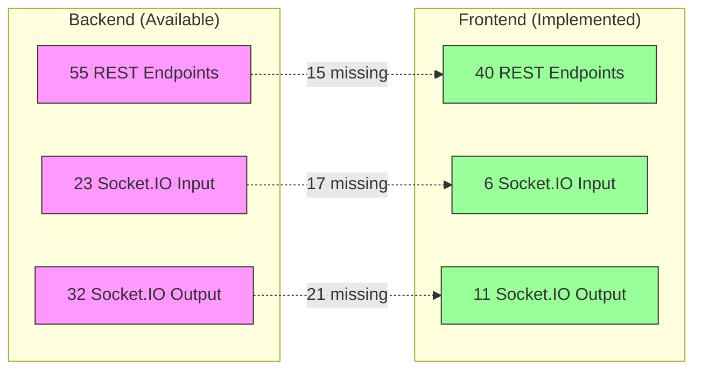

# Pending Actions List - Frontend-Backend Integration Gap Analysis

## Summary

| Category | Backend Available | Frontend Implemented | Gap |
|----------|------------------|---------------------|-----|
| REST API Endpoints | 55 | 40 | **15 missing** |
| Socket.IO Input Events | 23 | ~6 | **~17 missing** |
| Socket.IO Output Events | 32 | ~11 | **~21 missing** |

---

## 1. Missing REST API Endpoints in Frontend

### 1.1 General/Health Endpoints (Missing: 3/4)
| Endpoint | Description | Status |
|----------|-------------|--------|
| `GET /` | Root server status | ❌ Not in frontend |
| `GET /api/health` | Health check | ❌ Not in frontend |

### 1.2 ROS 2 Node Management (Missing: 2/2)
| Endpoint | Description | Status |
|----------|-------------|--------|
| `GET /api/nodes` | List active ROS 2 nodes | ❌ Not in frontend |
| `GET /api/node/{node_name}` | Detailed ROS 2 node info | ❌ Not in frontend |

### 1.3 Servo Manager Scripts (Missing: 6/7)
| Endpoint | Description | Status |
|----------|-------------|--------|
| `GET /servo/run` | Run servo script | ❌ Not in frontend |
| `GET /servo/stop` | Stop servo script | ❌ Not in frontend |
| `POST /servo/emergency_stop` | Emergency stop all servos | ❌ Not in frontend |
| `GET /servo/status` | Servo status + telemetry | ❌ Not in frontend |
| `GET /servo/edit` | Edit servo config (query params) | ❌ Not in frontend |
| `POST /servo/edit` | Edit servo config (JSON body) | ❌ Not in frontend |
| `GET /servo/log` | Read servo script log | ❌ Not in frontend |

### 1.4 RTK Endpoints (Missing: 1/8)
| Endpoint | Description | Status |
|----------|-------------|--------|
| `POST /api/rtk/force_clear` | Force-clear GPS RTK fix | ❌ Not in frontend |

### 1.5 Mission Endpoints (Missing: 4/14)
| Endpoint | Description | Status |
|----------|-------------|--------|
| `POST /api/mission/stop_controller` | Stop mission controller node | ❌ Not in frontend |
| `POST /api/mission/next` | Advance to next waypoint | ❌ Not in frontend |
| `POST /api/mission/skip` | Skip current waypoint | ❌ Not in frontend |

---

## 2. Missing Socket.IO Input Events (Frontend → Backend)

**Frontend currently emits:** `ping`, `set_gps_failsafe_mode`, `failsafe_acknowledge`, `start_lora_rtk_stream`, `stop_lora_rtk_stream`, `subscribe_mission_status`

| Event | Description | Priority |
|-------|-------------|----------|
| `send_command` | Unified command dispatch (ARM_DISARM, SET_MODE, GOTO, etc.) | 🔴 High |
| `request_mission_logs` | Request mission log history | 🟡 Medium |
| `get_mission_status` | Request current mission status | 🟡 Medium |
| `connect_caster` | Start NTRIP RTK corrections stream | 🟢 Using REST |
| `disconnect_caster` | Stop NTRIP RTK stream | 🟢 Using REST |
| `get_lora_rtk_status` | Get LoRa RTK handler status | 🟡 Medium |
| `request_rover_reconnect` | Force rover reconnection | 🟡 Medium |
| `manual_control` | Real-time joystick manual control | 🔴 High |
| `emergency_stop` | Emergency stop motors | 🔴 High |
| `stop_manual_control` | Stop manual control session | 🔴 High |
| `set_obstacle_detection` | Enable/disable obstacle detection | 🟡 Medium |
| `failsafe_resume_mission` | Resume mission after failsafe | 🟡 Medium |
| `failsafe_restart_mission` | Restart mission after failsafe | 🟡 Medium |

---

## 3. Missing Socket.IO Output Events (Backend → Frontend)

**Frontend currently listens to:** `telemetry`, `rover_data`, `mission_event`, `mission_status`, `mission_error`, `mission_command_ack`, `mission_controller_status`, `server_activity`, `mission_logs_snapshot`, `ping`, `pong`

| Event | Description | Priority |
|-------|-------------|----------|
| `connection_status` | Vehicle connection state | 🔴 High |
| `connection_response` | Connection confirmation with session ID | 🟡 Medium |
| `connection_warning` | Stale connection warning | 🟡 Medium |
| `server_health` | Periodic server health status | 🟢 Low |
| `server_log` | Server log messages | 🟢 Low |
| `command_response` | Response to `send_command` events | 🔴 High |
| `mission_status_history` | Cached mission status history | 🟡 Medium |
| `mission_status_subscribed` | Subscription confirmation | 🟢 Low |
| `mission_upload_progress` | Upload progress percentage | 🟡 Medium |
| `mission_download_progress` | Download progress percentage | 🟡 Medium |
| `caster_status` | NTRIP caster connection status | 🟡 Medium |
| `rtk_log` | RTK stream log messages | 🟢 Low |
| `rtk_forwarded` | RTK bytes forwarded counter | 🟢 Low |
| `rtcm_data` | Raw RTCM correction data | 🟢 Low |
| `rover_reconnect_ack` | Reconnect acknowledgment | 🟡 Medium |
| `manual_control_error` | Manual control error | 🔴 High |
| `manual_control_stopped` | Manual control session ended | 🔴 High |
| `failsafe_mode_changed` | GPS failsafe mode confirmation | 🟡 Medium |
| `failsafe_error` | GPS failsafe error | 🟡 Medium |
| `failsafe_acknowledged` | Failsafe acknowledgment | 🟡 Medium |
| `failsafe_resumed` | Failsafe mission resumed | 🟡 Medium |
| `failsafe_restarted` | Failsafe mission restarted | 🟡 Medium |
| `obstacle_detection_changed` | Obstacle detection toggle confirmation | 🟡 Medium |
| `obstacle_error` | Obstacle detection error | 🟡 Medium |

---

## 4. Priority Action Items

### 🔴 High Priority (Core Functionality)
1. **`send_command` Socket.IO event** - Unified command dispatch for arm/disarm, mode changes, GOTO
2. **`connection_status` Socket.IO event** - Critical for knowing vehicle connectivity
3. **`command_response` Socket.IO event** - Response handling for commands
4. **`/api/mission/next` endpoint** - Advance to next waypoint
5. **`/api/mission/skip` endpoint** - Skip current waypoint
6. **`manual_control` Socket.IO event** - Real-time joystick control
7. **`emergency_stop` Socket.IO event** - Safety-critical
8. **`manual_control_error` / `manual_control_stopped` events** - Manual control feedback

### 🟡 Medium Priority (Enhanced Features)
1. **`/api/nodes` endpoint** - ROS 2 node monitoring
2. **`/servo/*` endpoints** - Servo script management
3. **`set_obstacle_detection` Socket.IO event** - Obstacle avoidance toggle
4. **`failsafe_resume_mission` / `failsafe_restart_mission`** - Post-failsafe recovery
5. **`mission_upload_progress` / `mission_download_progress`** - Progress indicators
6. **`caster_status` event** - NTRIP status monitoring

### 🟢 Low Priority (Admin/Dev)
1. **`/api/health` endpoint** - Health checks
2. **`server_health` Socket.IO event** - Server monitoring
3. **`/api/rtk/force_clear` endpoint** - RTK troubleshooting
4. **`server_log` event** - Log streaming

---

## 5. Architecture Gap Diagram

---

**Total Integration Gaps: ~53** between backend capabilities and frontend implementation. The most critical gaps are the `send_command` event dispatcher, `connection_status` monitoring, and manual control events.

**Note:** Counts updated based on actual backend implementation verification (55/23/32) rather than documentation claims (59/24/35).